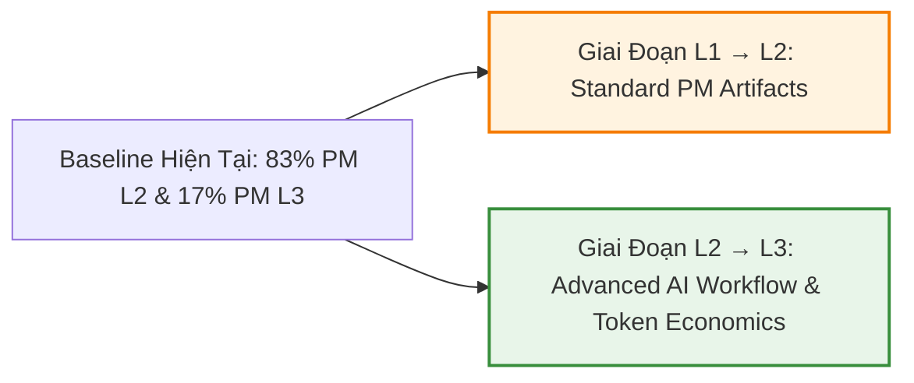

# 📋 BÁO CÁO TIẾN ĐỘ & KẾT QUẢ KHẢO SÁT NĂNG LỰC AI CHO PROJECT MANAGER (PM)
> **Cập nhật:** Tháng 7/2026  
> **Đơn vị:** Ban Đào tạo & Quản lý Dự án (PMO)  
> **Căn cứ:** Khung năng lực `level-AI-PM-tools.md` & Plan đào tạo chính thức `plan-dao-tao-PM-AI-integrated.md`  

---

## 📌 SUMMARY DASHBOARD (TỔNG QUAN THÔNG SỐ)

| 🎯 Tổng PM Khảo Sát | 📊 Tỷ Lệ Hoàn Thành | 📈 Tiến Độ Lộ Trình | 🏁 Mục Tiêu 6 Tháng (T+6) |
|:---:|:---:|:---:|:---:|
| **6 PMs** | **6 / 6 (100%)** | 🟢 **Đúng kế hoạch (On-track)** | **≥ 50% PM đạt Level 3 (Proficient)** |

---

## 📊 1. KẾT QUẢ KHẢO SÁT NĂNG LỰC AI CỦA ĐỘI NGŨ PM

### 📈 Phân Bổ Năng Lực 6 PM Theo Khung 6 Level (L0 – L5)

| Level | Tên Mức Độ Năng Lực | Số Lượng | Tỷ Lệ (%) | Biểu Đồ Tỷ Lệ | Trạng Thái Baseline |
|:---:|---|:---:|:---:|---|:---:|
| **L0** | **Unaware** (Chưa biết / Chưa dùng) | `0 / 6` | **0.0%** | ░░░░░░░░░░ | ⚪ Không có nhân sự |
| **L1** | **Apprentice** (Dùng prompt sẵn, shadow sprint) | `0 / 6` | **0.0%** | ░░░░░░░░░░ | ⚪ Đã qua mức cơ bản |
| **L2** | **Practitioner** (Tự viết prompt, làm PM artifacts, solo dự án nhỏ) | `5 / 6` | **83.3%** | ████████████████░ | 🟡 Chiếm số đông (Trọng tâm L2→L3) |
| **L3** | **Proficient** (Tích hợp AI workflow sprint, forecast token, ROI dương) | `1 / 6` | **16.7%** | ███░░░░░░░░░░░░░░ | 🟢 Cao nhất nhóm (Hạt nhân Mentoring) |
| **L4** | **Expert** (Custom GPT/Agent, Automation, multi-project, coach junior) | `0 / 6` | **0.0%** | ░░░░░░░░░░ | ⏳ Mục tiêu dài hạn |
| **L5** | **Master** (Chiến lược AI Tool SBU, Governance, Thought Leadership) | `0 / 6` | **0.0%** | ░░░░░░░░░░ | ⏳ Mục tiêu dài hạn |
| **Tổng** | **Toàn bộ đội ngũ PM** | **6 / 6** | **100%** | | |

---

### 📋 Bảng Đánh Giá Chi Tiết Từng Cá Nhân PM

*(Theo thang đánh giá 19 tiêu chí tại khảo sát tháng 7/2026)*

| STT | Họ và Tên | Email | Số Tiêu Chí Đạt L2+ (Choice C/D) | Level Xác Định | Phân Bổ Đáp Án (A / B / C / D) | Gap Chính Cần Bổ Sung | Vai Trò & Ưu Tiên |
|:---:|---|---|:---:|:---:|:---:|---|---|
| **1** | **Nguyễn Vương Hồng Ngọc** | `ngocnvh@kaopiz.com` | **16 / 19** (84%) | 🥈 **Level 3** | A: 0 \| B: 3 \| C: 10 \| D: 6 | Token Cost mới đọc dashboard; Báo cáo Stakeholder rập khuôn. | 🟢 **Mentoring & Peer Review** cho nhóm L2. |
| **2** | **Trương Văn Thao** | `thaotv@kaopiz.com` | **11 / 19** (58%) | 🥉 **Level 2** | A: 3 \| B: 5 \| C: 10 \| D: 1 | Viết PRD tay 100%; User Story chưa review kỹ; Prompt rời rạc. | 🟡 Ưu tiên đào tạo **L2 → L3**. |
| **3** | **Nguyễn Tiến Hoàn** | `hoannt1@kaopiz.com` | **10 / 19** (53%) | 🥉 **Level 2** | A: 5 \| B: 4 \| C: 9 \| D: 1 | Prompting ngắn; Chưa dùng AI cho User Story; Chưa track Token cost. | 🟡 Ưu tiên đào tạo **L2 → L3**. |
| **4** | **Phạm Huyền Trang** | `trangph@kaopiz.com` | **8 / 19** (42%) | 🥉 **Level 2** | A: 5 \| B: 6 \| C: 7 \| D: 1 | Chưa dùng AI cho User Story & Status Report; Thiếu ranh giới dùng AI. | 🟡 Ưu tiên đào tạo **L2 → L3**. |
| **5** | **Nguyễn Thị Hoàng Anh** | `anhnth@kaopiz.com` | **8 / 19** (42%) | 🥉 **Level 2** | A: 3 \| B: 8 \| C: 5 \| D: 3 | Chưa dùng AI viết PRD & User Story (viết tay); Chưa track Token cost. | 🟡 Ưu tiên đào tạo **L2 → L3**. |
| **6** | **Lê Bá Hoàng Giang** | `gianglbh@kaopiz.com` | **7 / 19** (37%) | 🥉 **Level 2** | A: 3 \| B: 9 \| C: 6 \| D: 1 | Báo cáo viết tay; Cảm tính ranh giới AI; Story chưa review kỹ. | 🟡 Ưu tiên đào tạo **L2 → L3**. |

---

### 💡 Nhận Xét & Phân Tích Chuyên Môn (Insights)

1. **Điểm mạnh cốt lõi:**
   - **Tư duy trách nhiệm & chống Hallucination (100% L2+):** 100% PM luôn review, kiểm chứng số liệu với nguồn thật trước khi gửi stakeholder.
   - **Kỹ năng công cụ nâng cao (Skill & MCP):** 100% PM đã tự tạo/dùng Skill và 83% đã kết nối MCP/Connector vào công việc.
   - **Thói quen sử dụng AI hàng ngày (100% L2+):** 100% PM đã đưa AI vào thói quen công việc hàng ngày.
2. **Lỗ hổng năng lực cần tập trung xử lý (Top 4 Core Gaps):**
   - **Token Cost & Financial Management (Chỉ 17% L2+):** 83% PM không track hoặc chỉ nhìn con số tổng thô, chưa biết forecast Token budget cho sprint.
   - **Tạo User Story & Acceptance Criteria chuẩn SDLC (Chỉ 17% L2+):** 83% PM chưa dùng AI cho User Story/AC hoặc copy nguyên vào Jira chưa review edge-cases.
   - **Áp dụng Bộ tool SDLC nội bộ (Chỉ 17% L2+):** Bộ tool Spec → RAG → SRS → Code mới dừng ở mức nghe/giới thiệu.
   - **Báo cáo Stakeholder chuyển đổi sang Business Value (Chỉ 33% L2+):** Nhiều PM chưa biết dùng AI dịch thuật số liệu kỹ thuật sang giá trị kinh doanh cho khách hàng/leadership.

---

## 📚 2. CHUẨN BỊ NỘI DUNG & TÀI LIỆU ĐÀO TẠO PM

### 👥 Đội Ngũ Nhân Sự Phụ Trách
* **Giảng viên / Facilitator:** PM Lead / PM L4+ & Ban Đào Tạo PMO.
* **Mentor đồng hành:** **Nguyễn Vương Hồng Ngọc** (PM Level 3) hỗ trợ Peer Review & hướng dẫn thực hành.

### 🧭 Định Hướng Ưu Tiên Lộ Trình (Tool-First Approach)

Theo plan chính thức `plan-dao-tao-PM-AI-integrated.md`, chương trình thiết kế 28 khóa học chia thành các chặng chính. Do baseline hiện tại có **83.3% PM ở Level 2**, ban đào tạo **tập trung tối đa vào giai đoạn L1 → L2 & L2 → L3**:

* **Ưu tiên 1 (Chuẩn hóa L1 → L2):** 
  - Đóng gói Prompt Library cá nhân ≥ 10 prompt.
  - Soạn PRD draft < 30 phút bằng AI.
  - Viết User Story + AC chuẩn hóa với AI.
* **Ưu tiên 2 (Nâng cấp L2 → L3):**
  - Quản trị Token Budget Forecast (Drill 2).
  - Lập AI Risk Register (Drill 3).
  - Status Report 1 trang + Video 5m cho Stakeholder (Drill 4).
  - Tích hợp AI vào toàn bộ Sprint Cycle (Sprint Planning, Refinement, Retro).

---

## 🗓️ 3. KẾ HOẠCH TRIỂN KHAI THÁNG 7/2026 — ONBOARDING & FOUNDATION CHO PM

* **Thời gian triển khai:** Từ tuần 3 đến tuần 4 tháng 7/2026.
* **Hình thức:** Workshop Hands-on (60% thực hành trực tiếp + 40% bối cảnh vận hành) + OJT thực tế trên dự án.
* **Danh sách các khóa học triển khai trong tháng 7/2026:**

| STT | Tên Khóa Học / Chủ Đề | Mục Tiêu Đạt Được & Đầu Ra (Deliverables) | Hình Thức / Thời Lượng | Trạng Thái |
|:---:|---|---|:---:|:---:|
| **01** | **Giới thiệu AI Tools & Agentic SDLC Context** | Hiểu landscape tool (ChatGPT, Claude, Notion, Jira AI, Copilot); định hình tư duy Orchestrator thay vì Tracker | Workshop 1 buổi × 2h | 🟡 Sẵn sàng |
| **02** | **Thực hành Prompt Library & PM Tasks cơ bản** | Chạy thử ≥ 5 prompt thư viện; thực hành biến transcript meeting thô → Meeting Notes hoàn chỉnh | Hands-on 1 buổi × 2h | 🟡 Sẵn sàng |
| **03** | **Quality Gate & Token Economics cơ bản** | Nắm vững quy định Quality Gate (không bypass) & nguyên lý chi phí Token khi chạy AI | Training 1 buổi × 2h | 🟡 Sẵn sàng |
| **04** | **Prompt Engineering chuẩn cấu trúc cho PM** | Làm chủ công thức Role + Context + Task + Format + Few-shot; kỹ năng refine prompt | Workshop 1 buổi × 2h | 🟡 Sẵn sàng |
| **05** | **AI-assisted PRD (<30 phút)** | Thực hành tạo PRD draft chuẩn cấu trúc từ Brief input trong < 30 phút; review checklist trước khi giao Dev | Workshop + Drill 2h | 🟡 Sẵn sàng |
| **06** | **AI-assisted User Story & Acceptance Criteria** | Generate User Story & AC từ PRD; quy trình audit phát hiện vague requirement & missing edge cases | Workshop + Drill 2h | 🟡 Sẵn sàng |

---

## 📝 4. GHI CHÚ QUẢN LÝ & CAM KẾT TIẾN ĐỘ (NOTES & COMMITMENTS)

> [!NOTE]
> 1. **Cam kết KPI Lộ trình 6 Tháng (Target T+6):**
>    - Đến tháng 12/2026, cam kết đạt **≥ 55% PM nâng cấp lên Level 3 (Proficient)** và **15% đạt Level 4 (Expert)**, 0% PM ở L1.
> 2. **Nguyên tắc "Tool-First nhúng Operational Context":**
>    - Không dạy lý thuyết suông. Mỗi bài học công cụ AI đều gắn liền với 1 sản phẩm dự án thật (PRD, User Story, Status Report, Token Forecast).
> 3. **Cơ chế Mentoring & Peer Review:**
>    - PM Nguyễn Vương Hồng Ngọc (đạt Level 3) sẽ hỗ trợ review bài nộp Drill 1-5 và hướng dẫn thực hành cho các PM nhóm Level 2.
> 4. **Đo lường thời gian tiết kiệm:**
>    - Tất cả PM tham gia đào tạo phải đo đạc thời gian thực hiện task trước và sau khi dùng AI, hướng tới mục tiêu **tiết kiệm ≥ 30% thời gian** quản lý dự án.

---

### 📌 XÁC NHẬN BÁO CÁO
* **Báo cáo gửi:** Ban Giám Đốc / PMO Head / Trưởng Bộ Phận Dự Án
* **Ngày cập nhật:** 23/07/2026
