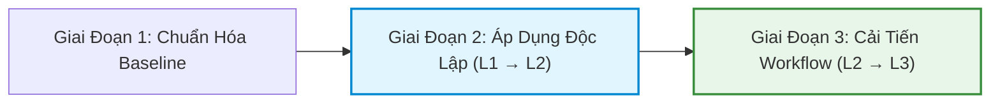

# 📋 BÁO CÁO TIẾN ĐỘ ĐÀO TẠO AI CHO TESTER
> **Cập nhật:** Tháng 7/2026  
> **Đơn vị:** Bộ phận Đào tạo & Quản lý Chất lượng (QA/QC)  
> **Người thực hiện:** QA/QC Lead & Ban Dự án AI Training  

---

## 📌 SUMMARY DASHBOARD (TỔNG QUAN THÔNG SỐ)

| 🎯 Tổng Nhân Sự Kế Hoạch | 📊 Khảo Sát Hoàn Thành | 📈 Tiến Độ Chung | 🏁 Mục Tiêu Hoàn Thành |
|:---:|:---:|:---:|:---:|
| **15 Tester** | **15/15 (100%)** | 🟢 **Đúng kế hoạch** | **Tháng 12/2026** |

---

## 📊 1. KẾT QUẢ KHẢO SÁT NĂNG LỰC AI (BASELINE ASSESSMENT)

### 📈 Phân Bổ Năng Lực 15 Tester Theo Khung 6 Level (L0 – L5)

| Level | Tên Mức Độ Năng Lực | Số Lượng | Tỷ Lệ (%) | Biểu Đồ Tỷ Lệ | Trạng Thái Baseline |
|:---:|---|:---:|:---:|---|:---:|
| **L0** | **Unaware** (Chưa tiếp xúc/Chưa biết) | `0 / 15` | **0.0%** | ░░░░░░░░░░ | ⚪ Không còn nhân sự |
| **L1** | **Novice** (Hiểu khái niệm, cần hướng dẫn) | `8 / 15` | **53.3%** | █████████████░░░ | 🟡 Chiếm đa số (Ưu tiên L1→L2) |
| **L2** | **Practitioner** (Áp dụng độc lập module nhỏ) | `5 / 15` | **33.3%** | ████████░░░░░░░ | 🔵 Lực lượng nòng cốt (Ưu tiên L2→L3) |
| **L3** | **Proficient** (Thiết kế & Cải tiến AI Workflow) | `2 / 15` | **13.3%** | ███░░░░░░░░░░░░ | 🟢 Hạt nhân lan tỏa / Mentor |
| **L4** | **Expert** (Xây dựng Custom Tool / Automation) | `0 / 15` | **0.0%** | ░░░░░░░░░░ | ⏳ Mục tiêu dài hạn |
| **L5** | **Master** (Tư vấn chiến lược & Thought Leader) | `0 / 15` | **0.0%** | ░░░░░░░░░░ | ⏳ Mục tiêu dài hạn |
| **Tổng** | **Toàn bộ bộ phận Tester** | **15 / 15** | **100%** | | |

> 💡 **Nhận xét & Phân tích chuyên môn:**
> - **Tập trung diện rộng (86.6%):** Phần lớn nhân sự đang ở level L1 và L2 (`13/15 Tester`). Đây là khoảng năng lực lý tưởng để bứt phá.
> - **Không còn L0 (0%):** 100% nhân sự Tester đều đã có hiểu biết cơ bản về AI.
> - **Định hướng đào tạo:**
>   - **Trọng tâm 1:** Chuẩn hóa nền tảng **L0 → L1** để tạo Baseline đồng nhất cho toàn team.
>   - **Trọng tâm 2:** Đẩy mạnh đào tạo nâng cấp **L1 → L2** (dùng AI độc lập cho module nhỏ) và **L2 → L3** (thiết kế workflow testing với AI).

---

## 📚 2. TIẾN ĐỘ CHUẨN BỊ NỘI DUNG & SLIDE ĐÀO TẠO

### 👥 Đội Ngũ Nhân Sự Phụ Trách
* **Nòng cốt biên soạn:** 03 Team Lead Tester + chị **Hoàng Anh**.
* **Phạm vi nội dung:** Xây dựng slide & tài liệu thực hành cho **20 chủ đề cốt lõi** theo *Framework Đào tạo Năng lực AI cho Tester/QA*.

### 🧭 Định Hướng Ưu Tiên Soạn Slide & Nội Dung

1. **Giai đoạn L1 → L2 (Đang ưu tiên soạn slide):**
   * *Mục tiêu:* Hướng dẫn Tester áp dụng AI độc lập vào các bài toán testing module nhỏ (sinh testcase, generate test data, viết script test cơ bản).
2. **Giai đoạn L2 → L3 (Đang ưu tiên soạn slide):**
   * *Mục tiêu:* Hướng dẫn Tester thiết kế, tối ưu và cải tiến quy trình testing tích hợp AI (AI Testing Workflow, kết nối tool kiểm thử).

---

## 🗓️ 3. KẾ HOẠCH TRIỂN KHAI THÁNG 7/2026 — CHỦ ĐỀ L0 → L1

* **Thời gian dự kiến:** Cuối tháng 7/2026.
* **Thời lượng:** ~6 giờ học lý thuyết & thực hành trực tiếp + thời gian tự nghiên cứu (Self-study).
* **Danh sách 05 khóa học nền tảng:**

| STT | Tên Khóa Học / Chủ Đề | Mục Tiêu Đạt Được | Hình Thức / Thời Lượng | Trạng Thái |
|:---:|---|---|:---:|:---:|
| **01** | **Tổng quan AI và vai trò của Tester** | Hiểu tư duy AI-assisted Testing, thay đổi mind-set từ manual/auto sang AI tester | Class 1.5h + Self-study | 🟡 Ready |
| **02** | **Hallucination, Context và giới hạn của AI** | Nhận diện rủi ro AI bịa thông tin, cách kiểm soát Context Window khi test | Class 1.0h + Self-study | 🟡 Ready |
| **03** | **Prompt Engineering cơ bản cho Tester** | Nắm vững cấu trúc prompt chuẩn (Role, Task, Context, Output Format) trong Testing | Class 1.5h + Practical | 🟡 Ready |
| **04** | **Bảo mật dữ liệu khi Tester sử dụng AI** | Quy định phân loại dữ liệu test, bảo mật thông tin khách hàng/dự án khi dùng LLM | Class 1.0h + Self-study | 🟡 Ready |
| **05** | **Review & Kiểm chứng output AI trên Karri Inspector** | Kỹ năng kiểm tra, thẩm định kết quả testcase/bugs do AI gợi ý trên công cụ nội bộ | Class 1.0h + Practical | 🟡 Ready |

---

## 📝 4. GHI CHÚ QUẢN LÝ & CAM KẾT TIẾN ĐỘ (NOTES & COMMITMENTS)

> [!NOTE]
> 1. **Đảm bảo mốc tiến độ tổng (Timeline Commitment):**
>    - Tiến độ đào tạo toàn ban vẫn **giữ đúng kế hoạch (On-track)** và sẽ hoàn thành toàn bộ lộ trình cho Tester vào **tháng 12/2026**.
> 2. **Lý do duy trì đào tạo L0 → L1 dù survey không còn L0:**
>    - Khảo sát ghi nhận `0% L0`, tuy nhiên việc tổ chức khóa L0 → L1 vẫn **bắt buộc triển khai** nhằm chuẩn hóa chuẩn kiến thức (baseline), đảm bảo toàn bộ 15 Tester nói cùng một "ngôn ngữ AI", hiểu đúng các nguyên tắc bảo mật & giới hạn trước khi bước vào các kỹ thuật L2/L3 phức tạp.
> 3. **Chiến lược làm trước slide L1→L2 & L2→L3:**
>    - Việc biên soạn đồng thời slide L1→L2 và L2→L3 trong tháng 7 giúp sẵn sàng tài liệu, có thể bấm nút triển khai ngay sau khi kết thúc đợt chuẩn hóa L0→L1 mà không bị đứt gãy tiến độ.

---

### 📌 XÁC NHẬN BÁO CÁO

* **Báo cáo gửi:** Ban Giám Đốc / PMO / Trưởng Bộ Phận QA
* **Ngày cập nhật:** 23/07/2026
