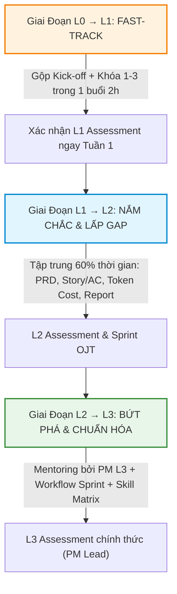

# 🚀 ĐỀ XUẤT PHƯƠNG ÁN TRIỂN KHAI ĐÀO TẠO AI CHO PM
> **Dựa trên:** Kết quả Survey 6 PM (Tháng 7/2026) × Khung kế hoạch đào tạo 6 tháng  
> **Đơn vị thực hiện:** Ban Đào tạo & Quản lý Dự án (PMO)  

---

## 🎯 1. PHÂN TÍCH BỐI CẢNH & NGUYÊN TẮC ĐIỀU CHỈNH LỘ TRÌNH

### 📊 Phân Phối Baseline Từ Survey
* **Level 0 / Level 1**: `0 / 6 PM` (**0%**) — 100% PM đã qua giai đoạn làm quen cơ bản.
* **Level 2 (Practitioner)**: `5 / 6 PM` (**83.3%**) — Đã biết dùng AI nhưng có lỗ hổng lớn về PRD, User Story/AC, Token Cost và Status Report.
* **Level 3 (Proficient)**: `1 / 6 PM` (**16.7%**) — Nguyễn Vương Hồng Ngọc (Đạt 84% L2+), sẵn sàng làm Mentor.

---

### 💡 3 Nguyên Tắc Điều Chỉnh Triển Khai Cốt Lõi

1. **Fast-track (Rút ngắn) Giai đoạn L0 → L1:** 
   Không học lại lý thuyết tò mò để tránh lãng phí thời gian. Gộp Kick-off + Khóa 1, 2, 3 thành **01 Buổi Kick-off & Alignment (2h)** để chuẩn hóa Baseline thời gian task & quy định Bảo mật/Token Economics. Pass L1 ngay tuần đầu.
2. **Focus 60% Nguồn lực vào L1 → L2 (Tháng 1 & 2):** 
   Tập trung xử lý triệt để 4 lỗ hổng cốt lõi của 5 PM Level 2: *AI PRD (<30m)*, *User Story & AC chuẩn Jira*, *Token Cost Tracking*, và *Báo cáo Stakeholder dịch sang Business Value*.
3. **Phát huy cơ chế Mentoring & Peer Review (L2 → L3):** 
   Giao PM **Nguyễn Vương Hồng Ngọc** (PM Level 3) làm Co-Mentor/Peer Reviewer cùng PM Lead để hỗ trợ 5 PM còn lại làm OJT và thực hành Drill 1 - 5.

---

## 🗓️ 2. KẾ HOẠCH TRIỂN KHAI CHI TIẾT THEO CÁC GIAI ĐOẠN

### ⏱️ Giai Đoạn 0: Survey & Measuring Baseline (~Tuần 1 - Tháng 1)
* **Hoạt động:** 
  1. Chốt kết quả Survey năng lực AI hiện tại (Đã hoàn thành với 6 PM).
  2. Thu thập **Baseline thời gian task thủ công** (Điền form: Thời gian viết 1 PRD, thời gian làm 1 status report, % task PM có AI).
* **Đầu ra:** Bảng Baseline Matrix cá nhân của 6 PM.

---

### ⚡ Giai Đoạn 1: Fast-track L0 → L1 (~Tuần 1-2 - Tháng 1)
> *Mục tiêu: Đảm bảo cùng baseline nhận thức, quy định bảo mật & Quality Gate.*

| STT | Khóa Học / Hoạt Động | Thời Lượng | Nội Dung & Cách Thức Triển Khai Điều Chỉnh | Đầu Ra (Deliverables) |
|:---:|---|:---:|---|---|
| **Step 1** | **Kick-off & Alignment Baseline** | 2.0 giờ *(Live)* | Gộp nội dung Kick-off + Khóa 1 + Khóa 2 + Khóa 3 thành 1 buổi: • Định vị PM là Orchestrator trong Agentic SDLC. • Thống nhất quy định Bảo mật dữ liệu (PII, NDA). • Tổng quan Token Economics & Quality Gate. • Thử nghiệm nhanh 5 prompt mẫu từ thư viện team. | Baseline sign-off + Cam kết tham gia |
| **Step 2** | **L1 Assessment (Manager Check)** | Async | Manager kiểm tra nhanh: Đủ tiêu chí L1 (Đã dùng AI daily, tự viết prompt cơ bản, tạo meeting notes). | **100% PM Pass L1 Assessment ngay Tuần 2** |

---

### 🎯 Giai Đoạn 2: Trọng Tâm L1 → L2 — Lấp Lỗ Hổng & Standard Artifacts (~Tháng 1.5 đến Tháng 3)
> *Mục tiêu: 100% PM tự làm PRD <30 phút, viết User Story/AC chuẩn, báo cáo stakeholder sắc bén & có Thư viện Prompt cá nhân ≥ 10 prompt.*

| STT | Khóa Học / Hoạt Động | Thời Lượng | Trọng Tâm Triển Khai Theo Data Survey | Bài Tập / Drill Yêu Cầu |
|:---:|---|:---:|---|---|
| **Khóa 4** | **Prompt Engineering chuẩn cấu trúc** | 2.0 giờ | Chuẩn hóa công thức Role + Context + Task + Format + Few-shot. Khắc phục lỗi gõ câu ngắn của PM Tiến Hoàn. | 3 prompt chuẩn cấu trúc có metadata |
| **Khóa 5** | **AI User Story & AC** *(Cần làm gấp)* | 2.0 giờ | 🌟 **Trọng tâm (83% PM hổng)**: Quy trình 2 bước generate Story/AC từ PRD & Review audit edge-cases trước khi push Jira. | Nộp 5 User Story + AC chuẩn hóa cho dự án thật |
| **Khóa 6** | **AI PRD (<30 phút)** *(Cần làm gấp)* | 2.0 giờ | 🌟 **Trọng tâm**: Giúp 3 PM (Hoàng Anh, Văn Thao, Tiến Hoàn) chuyển từ viết tay 100% sang draft PRD bằng AI < 30m. | 1 bản PRD draft hoàn chỉnh từ brief |
| **Khóa 7** | **AI Status Report cho Stakeholder** | 2.0 giờ | Dùng AI dịch thuật số liệu kỹ thuật (defect, velocity, token) sang ngôn ngữ giá trị kinh doanh cho khách hàng. | 1 Báo cáo Status Report 1 trang chuẩn Business Value |
| **Khóa 7B**| **Token Cost Tracking & ROI (Drill 1)** | 2.0 giờ | 🌟 **Bổ sung bắt buộc (83% PM hổng)**: Đọc Dashboard Token, nhận diện spike bất thường và tính ROI feature. | Bảng tính ROI Feature defendable trước TL |
| **Khóa 8** | **Xây Prompt Library cá nhân** | 2.0 giờ | Hướng dẫn tổ chức Thư viện Prompt cá nhân trên Notion/Obsidian (tối thiểu 10 prompt tái sử dụng). | Thư viện ≥ 10 Prompt có metadata |
| **OJT** | **Áp dụng vào Sprint thực tế** | 3–4 tuần | Áp dụng toàn bộ công cụ trên vào 1 dự án nhỏ/sprint đang chạy. PM Hồng Ngọc & Lead hỗ trợ. | Nhật ký đo đạc thời gian tiết kiệm |
| **Check**| **L2 Assessment (Manager + Peer)** | Async | Đánh giá theo tiêu chí L2: PRD <30m + Story AC pass + Status report pass + ROI Drill 1 pass. | **Đạt 100% PM xác nhận Level 2 chuẩn** |

---

### 🚀 Giai Đoạn 3: Bứt Phá L2 → L3 — Advanced AI Workflow & Team Standard (~Tháng 3.5 đến Tháng 6)
> *Mục tiêu: ≥ 55% PM đạt Level 3, làm chủ AI Workflow toàn Sprint, Token Budget Forecast ±20%, đóng góp Template cho team.*

| STT | Khóa Học / Hoạt Động | Thời Lượng | Trọng Tâm Triển Khai | Đầu Ra (Deliverables) |
|:---:|---|:---:|---|---|
| **Khóa 10**| **Prompt nâng cao (CoT, Few-shot)** | 2.0 giờ | Kỹ thuật Chain-of-thought, System Prompt và Few-shot prompting cho các bài toán phức tạp. | 2 bài tập prompt nâng cao |
| **Khóa 11**| **AI Workflow cho Sprint Cycle** | 2 buổi (4h) | Tích hợp AI vào trọn vẹn Sprint Cycle: Planning (breakdown), Refinement (refine story), Retro (feedback analysis). | Sơ đồ AI Sprint Workflow của dự án |
| **Khóa 11B**| **Token Budget Forecast & Risk (Drill 2 & 3)**| 2 buổi (4h) | 🌟 **Bổ sung nâng cao**: AI Risk Register (15 risks) + Forecast Token budget 3 sprint với độ chính xác ±20%. | Drill 2 (Token Forecast) & Drill 3 (Risk Register) |
| **Khóa 12**| **AI Data Analysis & Insight** | 2 buổi (4h) | Đi từ Raw Data (survey, NPS, defect density, velocity) sang Actionable Insights & Kế hoạch điều chỉnh. | Báo cáo Insight & Action Plan từ dữ liệu dự án |
| **Khóa 13**| **Chọn đúng tool cho đúng task (Tool Matrix)** | 2.0 giờ | So sánh ChatGPT vs Claude vs Copilot vs Notion/Jira AI. Xây dựng Tool Selection Matrix cho team. | Bảng Tool Selection Matrix hoàn chỉnh |
| **Khóa 14**| **Chuẩn hóa & Chia sẻ Template cho team** | 2.0 giờ | Đóng gói kinh nghiệm cá nhân thành 01 Template/Skill chuẩn cho team khác sử dụng lại. | ≥ 1 Prompt Template / Skill được team adopt |
| **OJT** | **Workflow AI đầy đủ trên Dự án Medium** | 4–5 tuần | Độc lập lead dự án medium với đầy đủ AI Workflow, track Adoption Rate ≥60% & thời gian tiết kiệm ≥30%. | Báo cáo tổng kết OJT L3 |
| **Review**| **Review tổng kết 6 tháng — Showcase** | 1 buổi | Buổi Showcase toàn bộ các bài làm xuất sắc, Custom Skill và chỉ số ROI/Tiết kiệm thời gian đạt được. | Slide Showcase & Demo |
| **Eval**  | **L3 Assessment chính thức (PM Lead)** | Async | Đánh giá chính thức cấp chứng nhận Level 3 cho các PM đạt điều kiện. | **≥ 55% PM đạt Level 3 (Proficient)** |

---

## 📊 3. BẢNG SO SÁNH KẾ HOẠCH GỐC VS KẾ HOẠCH ĐIỀU CHỈNH

| Hạng Mục | Kế Hoạch Đào Tạo Gốc | Kế Hoạch Triển Khai Điều Chỉnh (Tối Ưu Theo Survey) | Lý Do Điều Chỉnh |
|---|---|---|---|
| **Giai đoạn L0 → L1** | Học 3 khóa (Khóa 1, 2, 3) = ~7 giờ học lý thuyết & thực hành | **Fast-track**: Gộp Kick-off + Khóa 1, 2, 3 thành **1 buổi 2h**. Pass L1 ngay Tuần 2. | Survey cho thấy **0% PM ở L0/L1**, gộp lại giúp tiết kiệm 5h học trùng lặp. |
| **Phần Token Cost & ROI** | Đưa vào giai đoạn L2/L3 nâng cao | **Đưa ngay vào Giai đoạn L1 → L2 (Khóa 7B)** | Survey phát hiện **83% PM bị hổng Token cost & ROI**, cần bổ sung sớm. |
| **Trọng tâm L1 → L2** | Dành khoảng 4-6 tuần | **Tập trung 60% thời gian (6-8 tuần)** cho PRD, User Story/AC & Status Report | 5/6 PM (83.3%) đang ở Level 2 và cần chuẩn hóa các kỹ năng này trước. |
| **Nhân sự hỗ trợ** | PM Lead độc lập đào tạo | **PM Nguyễn Vương Hồng Ngọc (Level 3)** đồng hành Co-Mentor & Peer Review | Tận dụng nhân sự đạt Level 3 từ Survey để tăng tính tương tác & học hỏi ngang hàng. |

---

## 🎯 4. CAM KẾT ĐẦU RA KHI THỰC HIỆN THEO PHƯƠNG ÁN NÀY

1. **100% PM vượt qua L1 Assessment ngay trong Tháng 1/2026.**
2. **100% PM thuộc nhóm Level 2 hoàn thành các lỗ hổng (PRD <30m, Story AC chuẩn, Token Tracking) trước Tháng 3/2026.**
3. **Đạt ≥ 55% PM (ít nhất 3-4 PM) nâng cấp thành công lên Level 3 (Proficient) vào Tháng 12/2026 (T+6).**
4. **100% PM đạt workflow tiết kiệm ≥ 30% thời gian làm PM artifacts và Adoption Rate ≥ 60% task PM hàng ngày.**
