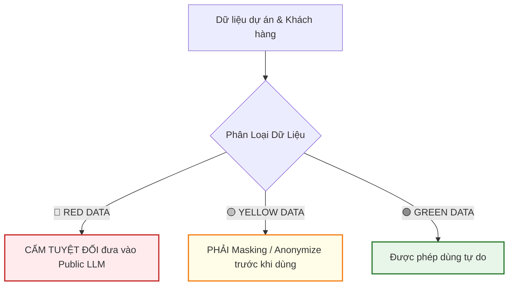

# 🎤 SLIDE BÀI GIẢNG LIVE (2.0 GIỜ): KICK-OFF & ALIGNMENT BASELINE CHO PM
> **Dành cho Người Đứng Lớp (Presenter / Trainer)**  
> **Khóa học:** Đào tạo AI Tools × Vận Hành AI Project cho PM  
> **Thời lượng:** 120 phút (Live Session) + Async Assessment  
> **Mục tiêu:** Fast-track L0 → L1, chuẩn hóa nhận thức, bảo mật dữ liệu, Token Economics & Quality Gate cho toàn bộ PM.

---

## ⏱️ AGENDAS & THỜI LƯỢNG CHI TIẾT (120 PHÚT)

```
[00-20m] 1. Mindset Shift & Kết quả Survey Baseline
   │
[20-40m] 2. Quy định Bảo mật Dữ liệu (PII, NDA) & Anti-Hallucination
   │
[40-70m] 3. Token Economics & Quality Gate cho PM
   │
[70-110m] 4. Hands-on Workshop: Chạy 5 Prompt Mẫu Thư Viện Team
   │
[110-120m] 5. Hướng dẫn L1 Assessment (Async) & Sign-off Baseline
```

---

## 🎬 NỘI DUNG CHI TIẾT TỪNG SLIDE & LỜI THOẠI ĐỨNG LỚP (SPEAKER NOTES)

### 📌 SLIDE 1: WELCOME & MỤC TIÊU KHÓA HỌC
**Nội dung Slide:**
* **Tiêu đề:** PM AI TRANSFORMATION: TỪ TRACKER SANG ORCHESTRATOR
* **Thời lượng:** 5 phút
* **Mục tiêu:** 
  1. Thống nhất góc nhìn mới về vai trò PM trong kỷ nguyên AI.
  2. Đi qua 5 trụ cột năng lực cốt lõi.
  3. Cam kết mục tiêu 6 tháng: ≥55% PM đạt Level 3 (Proficient), tiết kiệm ≥30% thời gian.

> 🗣️ **Lời thoại cho Giảng viên (Speaker Note):**
> *"Chào mừng toàn thể anh chị em PM! Hôm nay chúng ta bắt đầu hành trình 6 tháng nâng cấp năng lực AI. Mục tiêu của buổi Kick-off 2 tiếng hôm nay không phải để dạy lại những câu gõ ChatGPT cơ bản mà các bạn đã biết, mà là để **thống nhất ngôn ngữ chung**, **chuẩn hóa tư duy vận hành** và **thiết lập quy tắc an toàn dữ liệu**. Chúng ta sẽ cùng nhau chuyển đổi từ vai trò 'người đi gom status' (Tracker) sang 'người điều phối hệ thống Người + AI' (Orchestrator)."*

---

### 📌 SLIDE 2: 3 SỰ CHUYỂN DỊCH TƯ DUY CỐT LÕI (MENTAL MODEL SHIFTS)
**Nội dung Slide:**

| Tư Duy Cũ (Traditional SDLC) | ───► | Tư Duy Mới (Agentic SDLC & AI Tools) |
|---|:---:|---|
| **1. Project Tracker** *(Gom task, nhắc deadline, gõ sheet)* | ───► | **SDLC Orchestrator** *(Quản lý prompt, điều phối AI Agent + Con người)* |
| **2. Time-billing** *(Tính phí / nỗ lực theo Man-months, Man-hours)* | ───► | **Outcome-billing** *(Billing theo giá trị đầu ra & chất lượng bàn giao)* |
| **3. Raw Velocity** *(Số story points hoàn thành thô bằng mọi giá)* | ───► | **Quality Velocity** *(Tốc độ hoàn thành ĐẠT tiêu chuẩn Quality Gate)* |

> 🗣️ **Lời thoại cho Giảng viên (Speaker Note):**
> *"Anh chị em lưu ý 3 sự thay đổi này. Dùng AI không phải là bảo AI làm thay 100% rồi ngồi chơi, mà PM trở thành **Orchestrator** — người nhạc trưởng sắp xếp task nào cho Human, task nào cho AI Agent. Hai là, chúng ta đo đạc hiệu quả dựa trên **Outcome** chứ không phải số giờ gõ máy. Và ba là **Quality Velocity**: làm nhanh mà nợ kỹ thuật (technical debt) hoặc AI bịa thông tin lọt ra ngoài thì tốc độ đó bằng 0."*

---

### 📌 SLIDE 3: BỨC TRANH BASELINE HIỆN TẠI & LÝ DO FAST-TRACK L0 → L1
**Nội dung Slide:**
* **Báo cáo khảo sát 6 PM (Tháng 7/2026):**
  * 🔴 **Level 0 / Level 1:** `0%` (Không có ai ở mức nhập môn tò mò).
  * 🟡 **Level 2 (Practitioner):** `83.3%` (5 PMs) — Đã dùng AI hàng ngày nhưng bị hổng PRD, User Story, Token Cost & Status Report.
  * 🟢 **Level 3 (Proficient):** `16.7%` (1 PM - Hồng Ngọc) — Sử dụng AI chuyên sâu, sẵn sàng làm Co-Mentor.
* **Quyết định Chiến lược:** **Fast-track qua L1 trong 1 buổi hôm nay** để giải phóng 5 giờ học lý thuyết trùng lặp, tập trung 60% thời gian tiếp theo vào lấp lỗ hổng Level 2.

> 🗣️ **Lời thoại cho Giảng viên (Speaker Note):**
> *"Kết quả survey cho thấy tin rất vui: 100% team PM chúng ta đã qua mức 'tò mò xem AI là gì'. Chúng ta đã ở Level 2 và Level 3. Vì vậy, hôm nay chúng ta gom toàn bộ kiến thức nền tảng L1 lại thành buổi Fast-track này, để ngay từ tuần sau chúng ta đi thẳng vào các khóa thực chiến như viết PRD <30 phút và sinh User Story chuẩn Jira."*

---

### 📌 SLIDE 4: QUY ĐỊNH BẢO MẬT DỮ LIỆU KHI DÙNG AI (PII & NDA COMPLIANCE)
**Nội dung Slide:**



* 🔴 **RED (Cấm 100% đưa vào AI Public - ChatGPT free, Claude free...):**
  - PII (Họ tên, SĐT, Email, CCCD, Ngân hàng của khách hàng/nhân sự).
  - Source code bí mật thương mại, API Keys, Passwords, Database Credentials.
  - Hợp đồng NDA, Số liệu tài chính công ty chưa công bố.
* 🟡 **YELLOW (Cần làm sạch thông tin - Masking):**
  - Requirement thô của khách hàng (Cần đổi tên công ty khách thành ClientX, đổi tên dự án thành ProjectY).
* 🟢 **GREEN (Tự do):**
  - Kiến thức quản trị dự án chung, prompt mẫu public, meeting transcript đã làm sạch.

> 🗣️ **Lời thoại cho Giảng viên (Speaker Note):**
> *"Đây là Slide quan trọng nhất về mặt tuân thủ! Một sơ suất nhỏ đưa data PII của khách hàng lên ChatGPT công cộng có thể dẫn đến vi phạm hợp đồng NDA nghiêm trọng. Quy tắc bất di bất dịch: Red Data = Cấm 100%. Yellow Data = Phải ẩn danh (Masking) tên dự án, tên khách hàng trước khi dán vào AI."*

---

### 📌 SLIDE 5: TRÁCH NHIỆM CHỐNG HALLUCINATION (HUMAN-IN-THE-LOOP)
**Nội dung Slide:**
* **Nguyên tắc Human-in-the-loop (Con người là mắt xích cuối cùng):**
  - AI chỉ đóng vai trò **DRAFTING ASSISTANT** (Trợ lý soạn thảo nháp).
  - PM chịu **100% TRÁCH NHIỆM PHÁP LÝ & KỸ THUẬT** đối với mọi văn bản, báo cáo, PRD gửi cho Stakeholder và Dev Team.
* **Checklist 3 Bước Kiểm Chứng Output AI:**
  1. 🔍 **Verify Facts:** Số liệu, ngày tháng, tên nhân sự có đúng thực tế không?
  2. 🧠 **Audit Logic:** Các luồng nghiệp vụ (Business logic) có bị mâu thuẫn không?
  3. 🛡️ **Edge-case Check:** AI có bịa ra tính năng không có trong scope dự án không?

> 🗣️ **Lời thoại cho Giảng viên (Speaker Note):**
> *"Tuyệt đối không có tư duy 'AI nó viết thế nên em gửi khách thế'. Khách hàng và Tech Lead không nghiệm thu công việc với ChatGPT, họ nghiệm thu với PM. 100% output do AI tạo ra đều phải qua bộ lọc Review của bạn trước khi phát hành."*

---

### 📌 SLIDE 6: TỔNG QUAN TOKEN ECONOMICS CHO PM
**Nội dung Slide:**
* **Token là gì?** Đơn vị tính chi phí khi AI xử lý Input (Prompt) và Output (Response). 1,000 tokens ≈ 750 từ tiếng Anh (hoặc ~300-400 từ tiếng Việt).
* **Tại sao PM phải theo dõi Token Cost?**
  - Chi phí AI Agent/LLM được tính trực tiếp vào COGS (Cost of Goods Sold) của dự án.
  - Spike bất thường (Spike Token) = AI Agent bị lặp vô hạn (Infinite Loop), hoặc Prompt quá dài không tối ưu context.
* **Nhiệm vụ của PM:** Đọc Token Dashboard hàng tuần, nhận diện task nào đang ngốn token bất thường để cảnh báo Tech Lead.

> 🗣️ **Lời thoại cho Giảng viên (Speaker Note):**
> *"Ở Level 1 và 2, PM không cần viết code API Token, nhưng PM bắt buộc phải đọc được Dashboard Token. Nếu Sprint này Token cost vọt lên gấp 3 lần bình thường mà số Story Point không tăng, PM phải nhấc chuông cảnh báo ngay. Đó là tư duy quản trị tài chính dự án AI."*

---

### 📌 SLIDE 7: QUALITY GATE & EMERGENCY BYPASS PROCEDURE
**Nội dung Slide:**
* **Quality Gate là gì?** Bộ tiêu chí chất lượng bắt buộc phải vượt qua trước khi chuyển chặng SDLC (Spec → Code → Test → Release).
* **4 Tiêu chí Quality Gate không được silent skip (bỏ qua âm thầm):**
  1. Spec Definition Checklist (PRD đủ AC & Edge cases).
  2. Code Quality & Security Scan (Không có lỗi Critical/High).
  3. Automated Test Coverage (Đạt % coverage tối thiểu).
  4. User Acceptance Criteria Sign-off.
* **Quy trình Emergency Bypass (Khi áp lực Deadline):**
  - Phải có **Lý do kinh doanh rõ ràng** + **Kế hoạch bù nợ kỹ thuật (Technical Debt Remediate)** + **Sign-off của PM & Tech Lead**.

> 🗣️ **Lời thoại cho Giảng viên (Speaker Note):**
> *"Khi khách hàng hoặc sếp ép tiến độ, phản ứng của PM kém là âm thầm bỏ qua Quality Gate. PM giỏi AI sẽ giải thích: 'Nếu bypass Gate 2 để release hôm nay, rủi ro lỗi sẽ tăng 40%, chi phí sửa sau release sẽ gấp 5 lần. Anh/chị có ký duyệt Emergency Bypass không?'."*

---

### 📌 SLIDE 8: WORKSHOP HANDS-ON — PROMPT 1 & 2 (20 PHÚT)

#### 🧪 Prompt 1: Biến Transcript Meeting Thô thành Meeting Notes Chuẩn
```text
[ROLE]: Bạn là một Project Manager chuyên nghiệp.
[CONTEXT]: Đây là đoạn transcript thô từ buổi họp Sprint Planning sáng nay với team Dev.
[TASK]: Hãy tóm tắt lại thành 1 bản Meeting Notes chuẩn gồm 4 phần: 
1. Mục tiêu Sprint
2. Các quyết định chính đã thống nhất
3. Bảng Action Items (Cột: Task | Người phụ trách | Deadline)
4. Rủi ro / Blockers cần theo dõi
[FORMAT]: Markdown sạch nét, bảng biểu rõ ràng.
[TRANSCRIPT]: 
<Paste đoạn transcript vào đây>
```

#### 🧪 Prompt 2: Soạn Email Update Tiến Độ Cho Stakeholder Non-technical
```text
[ROLE]: Bạn là PM phụ trách truyền thông dự án.
[CONTEXT]: Sprint 5 vừa hoàn thành 80% kế hoạch, bị trễ 2 task do chờ API bên thứ 3.
[TASK]: Viết 1 email ngắn gọn (dưới 250 từ) gửi cho Client Director (người không có chuyên môn IT).
[REQUIREMENT]: 
- Dùng ngôn ngữ kinh doanh dễ hiểu (không dùng thuật ngữ technical jargon như API, CI/CD, Refactor).
- Nêu rõ tác động đến mốc Go-live chung và giải pháp ứng phó của team.
```

> 🗣️ **Lời thoại cho Giảng viên (Speaker Note):**
> *"Mọi người mở ChatGPT/Claude lên, copy Prompt 1 và dán đoạn transcript thực tế của dự án mình vào. Observe xem AI ra kết quả trong 10 giây và so sánh với cách làm tay mất 30 phút trước đây!"*

---

### 📌 SLIDE 9: WORKSHOP HANDS-ON — PROMPT 3 & 4 (20 PHÚT)

#### 🧪 Prompt 3: Brief Thô → Draft PRD Cấu Trúc < 30 Phút
```text
[ROLE]: Bạn là Lead Business Analyst / PM.
[CONTEXT]: Dự án chuẩn bị làm tính năng "Đăng nhập bằng Biometric (Vân tay/FaceID)" cho ứng dụng Mobile Banking.
[TASK]: Tạo bản thảo PRD (Product Requirement Document) gồm các section:
1. Business Goal & KPI
2. User Stories cốt lõi
3. Functional Requirements & Non-functional Requirements (Security, Performance)
4. Out-of-scope (Các phần không làm trong giai đoạn 1)
[FORMAT]: Trình bày bảng và gạch đầu dòng chuyên nghiệp.
```

#### 🧪 Prompt 4: Generate User Story & Acceptance Criteria (Given-When-Then)
```text
[ROLE]: Bạn là Agile BA.
[CONTEXT]: Từ tính năng Biometric Login ở trên.
[TASK]: Viết 3 User Stories chi tiết kèm Acceptance Criteria theo cấu trúc Given-When-Then cho trường hợp:
- User đăng nhập thành công bằng FaceID.
- User nhập sai vân tay quá 3 lần.
- Thiết bị không hỗ trợ phần cứng Biometric.
```

---

### 📌 SLIDE 10: WORKSHOP HANDS-ON — PROMPT 5 (10 PHÚT)

#### 🧪 Prompt 5: Phân Tích Sprint Retro & Rút Out Action Plan
```text
[ROLE]: Bạn là Agile Coach / PM.
[CONTEXT]: Đây là danh sách 15 ý kiến feedback thô của team Dev/Tester trong buổi Retrospective cuối Sprint.
[TASK]: Phân tích và nhóm các ý kiến theo khung 3P (Good / Bad / Try):
1. Nhận diện 3 Bottlenecks (Điểm nghẽn) lớn nhất đang làm giảm Quality Velocity.
2. Đề xuất 3 Action Items cụ thể cho Sprint tiếp theo (mỗi action có người chịu trách nhiệm & tiêu chí đo lường).
[FEEDBACK DATA]:
<Paste dữ liệu feedback vào đây>
```

---

### 📌 SLIDE 11: STEP 2 — HƯỚNG DẪN L1 ASSESSMENT (ASYNC) & SIGN-OFF

**Nội dung Slide:**
* **Tiêu chí Đạt L1 Assessment (Manager Check):**
  1. ✅ Tham gia đầy đủ buổi Live Kick-off (hoặc xem lại ghi hình + nộp bài).
  2. ✅ Đã đưa AI vào thói quen công việc hàng ngày (Daily usage).
  3. ✅ Nộp **01 Sản phẩm Meeting Notes hoàn chỉnh** được tạo từ Meeting Transcript dự án thật bằng AI (nộp trước Tuần 2).
  4. ✅ Ký cam kết tuân thủ quy định **Bảo mật dữ liệu (PII/NDA)** và **Quality Gate**.
* **Định hướng tuần tiếp theo:**
  - Bước vào **Giai đoạn L1 → L2**: Khóa 4 (Prompt Eng nâng cao) & Khóa 5 (User Story & AC thực chiến trên Jira).

> 🗣️ **Lời thoại cho Giảng viên (Speaker Note):**
> *"Cảm ơn mọi người! Cuối buổi hôm nay, xin mời 100% anh chị em điền link Baseline Sign-off. Trong tuần tới, các bạn nộp 1 sản phẩm Meeting Notes làm từ AI cho Manager kiểm tra. Chúng ta chính thức hoàn thành Fast-track Level 1 và sẵn sàng cho chặng bứt phá Level 2!"*

---

## 📋 THÔNG TIN ĐÃ ĐƯỢC TÍCH HỢP VÀO HỆ THỐNG HTML & WEB PORTAL

Nội dung bài giảng slide đứng lớp trên đã được tích hợp trực tiếp vào file [slide-kickoff-alignment-pm-ai.md](file:///c:/Users/Admin/Claude/Projects/PlanPM/slide-kickoff-alignment-pm-ai.md), đồng thời cập nhật vào mã nguồn web `generate_site.py` để hiển thị thành một Tab Slide giảng dạy chuyên nghiệp tại [index.html](file:///c:/Users/Admin/Claude/Projects/PlanPM/index.html).
